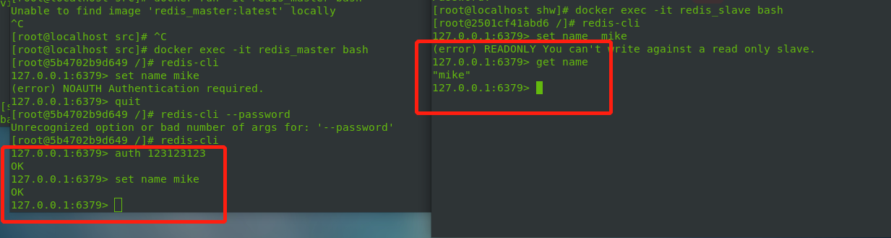
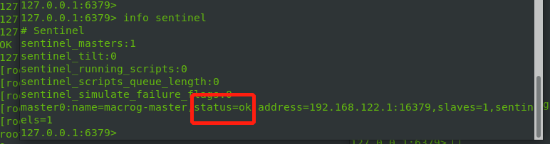
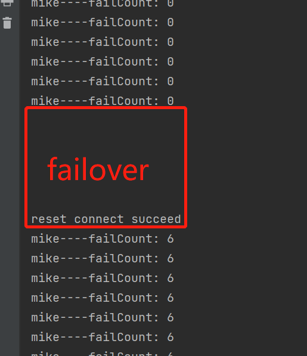

## Redis相关实验

#### fail-over实验

###### 实验准备：
    测试代码，向Redis主节点按照固定频率刷数据
    服务器：一台master、两台slave、三台哨兵
    环境：VMware虚拟机 docker环境

    端口分布：16379 26379 36379  46379 56379 56380

###### 测试代码内容

[here](../testCode/failover)

###### Redis服务器配置
    
    启动docker: 
            sudo systemctl start docker
    部署主节点Redis服务器：
            docker run -d -it -p 16379:6379 --name redis_master centos:7
            // 启动名字为redis_master的容器 端口容器内到容器外映射6379->16379 -d 后台模式运行
            docker exec -it redis_master bash
            // 进入启动的容器内部
            yum install -y epel-release
            yum install -y redis // 安装redis服务器
             
            vim ~/master.conf // 添加配置信息
                protected-mode yes
                port 6379
                tcp-backlog 511
                unixsocket /tmp/redis_auth.sock
                unixsocketperm 777
                timeout 0
                tcp-keepalive 300
                daemonize yes
                supervised auto
                ...

    redis-server ~/master.conf // 启动Redis服务
    /usr/bin/redis-cli shutdown // 关闭Redis服务
    使用同样方式部署Redis服务的从节点。
    docker run -d -it -p 26379:6379 --name redis_slave centos:7
    docker exec -it redis_slave bash
    vi ~/redis.conf
    yum install -y epel-release && yum install -y redis
    redis-server ~/redis.conf

    最终部署1个master两个slave节点。
###### 三台哨兵节点部署
    按照上述部署主从节点步骤即可，哨兵配置文件如下：
        port 46380
        daemonize yes
        protected-mode no
        sentinel myid 531173eb9cbd57e796584fc8d55f2b2df8114ed7
        # Generated by CONFIG REWRITE
        dir "/"
        sentinel monitor macrog-master 192.168.122.1 16379 2
        sentinel config-epoch macrog-master 0
        sentinel leader-epoch macrog-master 0
        sentinel current-epoch 0

    哨兵启动命令:redis-server ~/redis.conf --sentinel
    
    验证主从节点是否正常工作
    登录主节点，设置一个key,从节点进行get操作

    启动哨兵节点,查看主节点健康状态

###### 实验结果

    当服务启动后，运行一段时间，然后手动停止master节点，最终哨兵节点发现master故障
    由ok->sdown->odown->ok完成节点切换。

    因为模拟是单线程环境，每隔100ms一次写请求，所以qps约为10。failover过程中有
    6个请求是失败的。最后重连成功。
    总之failover过程，会stop the world一段时间，然后恢复，请求是有损的。

#### docker命令

    停止所有容器:docker stop$(docker ps -aq) 1
    删除所有容器:docker rm$(docker ps -aq) 1

    实验过程中发现使用docker-compose编排容器比较方便，推荐使用这种方法。

## 参考
[redis-io](https://redis.io/topics/cluster-tutorial)  
[master slave replication of redis using docker](https://developpaper.com/master-slave-replication-of-redis-using-docker/)   
[Google Borg](https://storage.googleapis.com/pub-tools-public-publication-data/pdf/43438.pdf)

