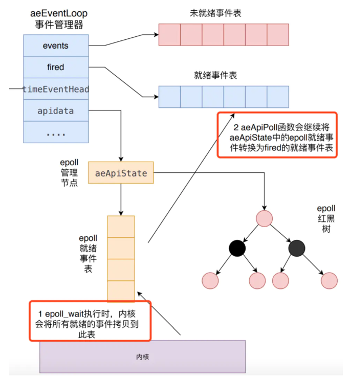

## Redis里的事件

    （1）文件事件(fileEvent)，客户端与服务器的socket连接，读命令，写命令都是文件事件。redis服务器是单线程，采用I/O多路复用来处理多个客户端的请求。
    （2）时间事件(TimeEvent)，处理一些需要定时执行和周期性执行的操作。
     (3)就绪事件(firedEvent)，文件事件描述符中有读或者写事件就绪的描述符。就绪事件一般是文件事件的子集。

#### 文件事件、

        typedef struct aeFileEvent {//定义文件事件结构体 文件事件主要是网络I/O
            int mask; /* one of AE_(READABLE|WRITABLE|BARRIER) */
            aeFileProc *rfileProc;
            aeFileProc *wfileProc;
            void *clientData;
        } aeFileEvent;
        
#### 时间事件、

        /* 时间事件结构 */
        typedef struct aeTimeEvent {//定义时间事件结构体，时间事件主要是指后台处理发生的事件
            long long id;  //ID编号
            long when_sec; //事件到达时间
            long when_ms;
            aeTimeProc *timeProc;
            aeEventFinalizerProc *finalizerProc;
            void *clientData;
            struct aeTimeEvent *prev; //时间事件基于双向链表链接
            struct aeTimeEvent *next;
        } aeTimeEvent;

#### 事件处理器、

        /* State of an event based program */
        typedef struct aeEventLoop {//事件处理器
            int maxfd;    //当前监听的最大文件编号
            int setsize; //跟踪的文件描述符的最大数量：数组的最大容量
            long long timeEventNextId;//下一个时间事件ID
            time_t lastTime; //用于检测系统时间偏差
            aeFileEvent *events; //注册的文件事件，基于数组实现
            aeFiredEvent *fired; //待处理的事件编号和类型
            aeTimeEvent *timeEventHead;//注册的时间事件，基于链表实现
            int stop;//是否停止处理
            void *apidata; //主要是与epoll机制下的socket描述符列表交互
            aeBeforeSleepProc *beforesleep;//事件执行前前置函数
            aeBeforeSleepProc *aftersleep;//事件执行后后置函数
            int flags;
        } aeEventLoop;
        为什么时间事件基于链表组织的，而文件事件基于数组组织的。
        将时间事件、文件事件的特点和数组和链表各自的特点出发进行回答。
        
#### 事件处理器的处理流程、

    void aeMain(aeEventLoop *eventLoop) {
        eventLoop->stop = 0;
        while (!eventLoop->stop) {//单线程处理
            if (eventLoop->beforesleep != NULL)
                eventLoop->beforesleep(eventLoop);
            //先处理文件事件，再处理时间事件
            // 文件事件主要是上游请求，需要及时处理并响应
            aeProcessEvents(eventLoop, AE_ALL_EVENTS|AE_CALL_AFTER_SLEEP);
        }
    }
#### Redis事件处理结构图
###### 文件事件处理结构图

## 参考
    https://juejin.im/post/5d4c3a5df265da03934bcbe8