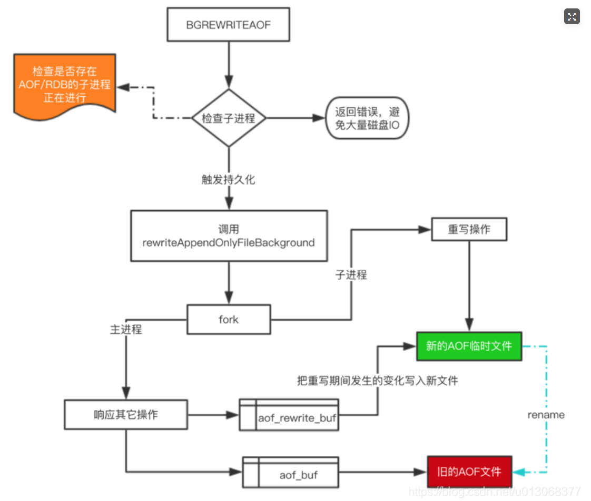

## aof持久化原理
   
   AOF类似MySQL中redo log。MySQL中使用redo log实现对所有写命令的持久化，
   redo log主要用来对数据做恢复使用。

#### 持久化机制

    
    1、所有的写命令会追加到 AOF 缓冲中。
    2、AOF 缓冲区根据对应的策略向硬盘进行同步操作，AOF文件落盘是同步操作，会阻塞请求。
    3、随着 AOF 文件越来越大，需要定期对 AOF 文件进行重写，达到压缩的目的。
    4、当 Redis 重启时，可以加载 AOF 文件进行数据恢复。

#### 文件写入和同步

    Redis每次结束一个事件，都会调用flushAppendOnlyFile函数，将aof缓存数据
    写入到aof文件中。
    关于AOF文件同步机制有三个参数可选:
    redis.conf:appendfsync
    1、always 写入磁盘频率最高，每个事件结束都会写入，只会丢失一个事件。
    2、everysec 每隔一秒同步一次，会有数据丢失。
    3、no 写入磁盘频率最低。
    
#### AOF文件重写
    随着Redis运行时间越来越长，AOF文件会越来越大，因此需要考虑对
    AOF文件进行压缩。重写就是为了实现文件的压缩。
    比如对连续相同命令的压缩
    
#### AOF重写流程图

#### 关键函数源码
    //AOF缓冲区数据持久化接口
    int rewriteAppendOnlyFileBackground(void) {
            pid_t childpid;
            //判断是否存在运行的子进程
            if (hasActiveChildProcess()) return C_ERR;
            //创建管道
            if (aofCreatePipes() != C_OK) return C_ERR;
            //打开管道,用于父子进程通信
            openChildInfoPipe();
            //当前是子进程
            if ((childpid = redisFork()) == 0) {
                char tmpfile[256];       
                ...
                //对AOF文件进行重写
                if (rewriteAppendOnlyFile(tmpfile) == C_OK) {
                    sendChildCOWInfo(CHILD_INFO_TYPE_AOF, "AOF rewrite");
                    exitFromChild(0);
                } else {
                    exitFromChild(1);
                }
            } else {//当前是父进程
                //子进程创建失败
                if (childpid == -1) {
                    closeChildInfoPipe();//关闭管道
                    ...
                    return C_ERR;
                }
                ...
                replicationScriptCacheFlush();
                return C_OK;
            }
            return C_OK; /* unreached */
    }
    //创建管道实现父子进程之间的通信
    int aofCreatePipes(void) {
        int fds[6] = {-1, -1, -1, -1, -1, -1};
        int j;
    
        if (pipe(fds) == -1) goto error; //数据管道，发送父进程新增加的AOF写命令到子进程。父进程会向子进程不断发送缓存中的数据，
        子进程定时读取缓存中的数据。
        if (pipe(fds+2) == -1) goto error; //子进程向父进程发起确认成功的ACK,这里是"!"信号。
        if (pipe(fds+4) == -1) goto error; //父进程向子进程回复确认的管道
        /* Parent -> children data is non blocking. */
        if (anetNonBlock(NULL,fds[0]) != ANET_OK) goto error;
        if (anetNonBlock(NULL,fds[1]) != ANET_OK) goto error;
        if (aeCreateFileEvent(server.el, fds[2], AE_READABLE, aofChildPipeReadable, NULL) == AE_ERR) goto error;
    
        server.aof_pipe_write_data_to_child = fds[1];
        server.aof_pipe_read_data_from_parent = fds[0];
        server.aof_pipe_write_ack_to_parent = fds[3];
        server.aof_pipe_read_ack_from_child = fds[2];
        server.aof_pipe_write_ack_to_child = fds[5];
        server.aof_pipe_read_ack_from_parent = fds[4];
        server.aof_stop_sending_diff = 0;
        return C_OK;  
        ...           
    }
    
    // 具体重写逻辑

      int rewriteAppendOnlyFileRio(rio *aof) {
         dictIterator *di = NULL;
         dictEntry *de;
         size_t processed = 0;
         int j;
         long key_count = 0;
         long long updated_time = 0;
      
       for (j = 0; j < server.dbnum; j++) { // 遍历内存字典结构
           char selectcmd[] = "*2\r\n$6\r\nSELECT\r\n";
           redisDb *db = server.db+j; // 获取dataset数组
           dict *d = db->dict; // 拿到字典句柄
           if (dictSize(d) == 0) continue;
           di = dictGetSafeIterator(d); // 迭代式获取entry节点
   
           /* SELECT the new DB */
           if (rioWrite(aof,selectcmd,sizeof(selectcmd)-1) == 0) goto werr;
           if (rioWriteBulkLongLong(aof,j) == 0) goto werr;
   
           // 循环迭代每一个entry
           while((de = dictNext(di)) != NULL) {
               sds keystr;
               robj key, *o;
               long long expiretime;
   
               keystr = dictGetKey(de);
               o = dictGetVal(de);
               initStaticStringObject(key,keystr);
   
               expiretime = getExpire(db,&key);
   
               // 保存key-value expire等属性值
               if (o->type == OBJ_STRING) { // 如果是字符串
                   // 重构set命令
                   char cmd[]="*3\r\n$3\r\nSET\r\n";
                   if (rioWrite(aof,cmd,sizeof(cmd)-1) == 0) goto werr;
                   // 持久化key-value
                   if (rioWriteBulkObject(aof,&key) == 0) goto werr;
                   if (rioWriteBulkObject(aof,o) == 0) goto werr;
               } else if (o->type == OBJ_LIST) {
                   if (rewriteListObject(aof,&key,o) == 0) goto werr;
               } else if (o->type == OBJ_SET) {
                   if (rewriteSetObject(aof,&key,o) == 0) goto werr;
               } else if (o->type == OBJ_ZSET) {
                   if (rewriteSortedSetObject(aof,&key,o) == 0) goto werr;
               } else if (o->type == OBJ_HASH) {
                   if (rewriteHashObject(aof,&key,o) == 0) goto werr;
               } else if (o->type == OBJ_STREAM) {
                   if (rewriteStreamObject(aof,&key,o) == 0) goto werr;
               } else if (o->type == OBJ_MODULE) {
                   if (rewriteModuleObject(aof,&key,o) == 0) goto werr;
               } else {
                   serverPanic("Unknown object type");
               }
               // 持久化过期时间
               if (expiretime != -1) {
                   char cmd[]="*3\r\n$9\r\nPEXPIREAT\r\n";
                   if (rioWrite(aof,cmd,sizeof(cmd)-1) == 0) goto werr;
                   if (rioWriteBulkObject(aof,&key) == 0) goto werr;
                   if (rioWriteBulkLongLong(aof,expiretime) == 0) goto werr;
               }
               // 从父进程重写命令缓冲区读取新加入的命令，通过管道读取
               if (aof->processed_bytes > processed+AOF_READ_DIFF_INTERVAL_BYTES) {
                   processed = aof->processed_bytes;
                   aofReadDiffFromParent();
               }
   
               /* Update info every 1 second (approximately).
                * in order to avoid calling mstime() on each iteration, we will
                * check the diff every 1024 keys */
               if ((key_count++ & 1023) == 0) {
                   long long now = mstime();
                   if (now - updated_time >= 1000) {
                       sendChildInfo(CHILD_INFO_TYPE_CURRENT_INFO, key_count, "AOF rewrite");
                       updated_time = now;
                   }
               }
           }
           dictReleaseIterator(di);
           di = NULL;
       }
       return C_OK;
      werr:
      if (di) dictReleaseIterator(di);
      return C_ERR;
      }

#### IPC管道通信特点

    1、管道通信底层是基于inode节点实现，类似文件同行
    2、管道通信比较耗时
    3、管道通信是半双工通信的，如果父子进程需要同时互相通信，需要分别建立两个管道。
    4、管道只适用于父子进程通信
    
    全双工通信:双方可以同时传输数据
    双工通信：
    半双工通信：同一时刻双方只能有一方可以传递数据
    单工通信：只可以从A到B,不可以从B到A
    
   