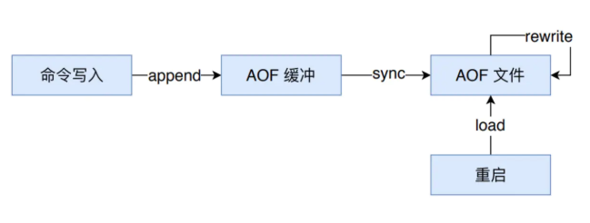

## aof持久化原理

#### 持久化机制

    
    1、所有的写命令会追加到 AOF 缓冲中。
    2、AOF 缓冲区根据对应的策略向硬盘进行同步操作。
    3、随着 AOF 文件越来越大，需要定期对 AOF 文件进行重写，达到压缩的目的。
    4、当 Redis 重启时，可以加载 AOF 文件进行数据恢复。

#### 文件写入和同步

    Redis每次结束一个事件，都会调用flushAppendOnlyFile函数，将aof缓存数据
    写入到aof文件中。
    关于AOF文件同步机制有三个参数可选:
    redis.conf:appendfsync
    1、always 写入磁盘频率最高，每个事件结束都会写入，只会丢失一个事件。
    2、everysec 每隔一秒同步一次，会有数据丢失。
    3、no 写入磁盘频率最低。
#### AOF文件重写
    随着Redis运行时间越来越长，AOF文件会越来越大，因此需要考虑对
    AOF文件进行压缩。重写就是为了实现文件的压缩。
    比如对连续相同命令的压缩