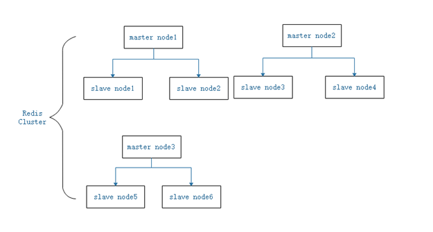
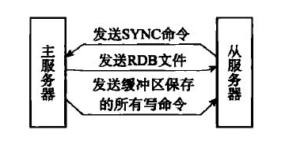
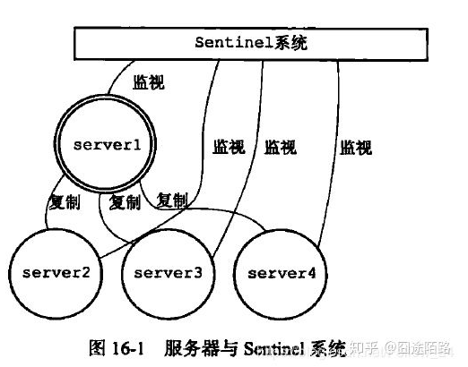
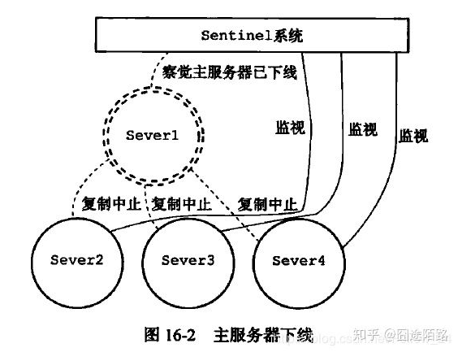

## Redis cluster

#### Redis集群结构描述:

    Redis中存在多个master，每个master又可以有多个slave，现假设有集群中有9个节点，3个master，
    每个master节点又有2个slave，那么它的结构可以表示如图:
        
#### 

#### Redis集群与raft协议的区别:

   1.Redis集群中有多个master,每个master有多个slave节点，master节点负责写，slave节点负责读
     因此Redis集群没有中心节点，是多个master并存。master节点之间通过ping pong meet等命令保持联系
   
   2.raft协议中节点存在三种状态，分别是follower、leader、candidate。其中leader和follower是同时存在。当集群
     中任意一个节点竞选超时后，变会转换为candidate,主动发起投票，其它节点响应进行投票。
   
   3.raft协议中leader与follower节点如何保持数据一致性的。
#### 结构体信息:
    
    //节点报告故障情况
    typedef struct clusterNodeFailReport {
        struct clusterNode *node;  /* Node reporting the failure condition. */
        mstime_t time;             /* Time of the last report from this node. */
    } clusterNodeFailReport;
        
    //节点基本属性信息
    typedef struct clusterNode {
        mstime_t ctime; /* 节点创建时间. */
        char name[CLUSTER_NAMELEN]; /* 节点名称 */
        int flags;      /* CLUSTER_NODE_... */
        ......
        char ip[NET_IP_STR_LEN];  /* 此节点最新的已知的IP地址 */
        int port;                   /* 节点最新客户端端口 */
        int cport;                  /* 节点最新集群端口. */
        clusterLink *link;          /* 此节点的tcp/ip连接端口 */
        list *fail_reports;         /* 发出失败信号的节点列表 */
    } clusterNode;
    
    //集群节点状态结构
    typedef struct clusterState {
        clusterNode *myself;  /* This node */
        uint64_t currentEpoch;//当前任期
        int state;            /* CLUSTER_OK, CLUSTER_FAIL, ... */
        int size;             /* Num of master nodes with at least one slot */
        dict *nodes;          /* Hash table of name -> clusterNode structures */
        dict *nodes_black_list; /* Nodes we don't re-add for a few seconds. */
        clusterNode *migrating_slots_to[CLUSTER_SLOTS];
        /*
        migrating_slots_to数组记录了16384个槽位中，当前节点所负责的槽位正在迁出到哪个节点。
        比如server.cluster->migrating_slots_to[0] = node，这说明当前节点负责的0号槽位，
        正在迁出到node节点；
        */
        clusterNode *importing_slots_from[CLUSTER_SLOTS];
        /*
        mporting_slots_from数组记录了16384个槽位中，当前节点正在从哪个节点将某个槽位迁入到本节点中；
        比如server.cluster->importing_slots_from[0] = node，这说明当前节点正在从node节点处迁入0号槽位；
        */
        clusterNode *slots[CLUSTER_SLOTS];//每个节点负责一定数量的虚拟槽
        /*
        slots数组记录了16384个槽位，分别由哪个集群节点负责：
        比如server->cluster.slots[0] = node，这说明0号槽位由node节点负责；
        */
        uint64_t slots_keys_count[CLUSTER_SLOTS];
        rax *slots_to_keys;
        /* The following fields are used to take the slave state on elections. */
        mstime_t failover_auth_time; /* 上次或者下次选举的时间. */
        int failover_auth_count;    /* 目前为止获得的投票. */
        int failover_auth_sent;     /* True if we already asked for votes. */
        int failover_auth_rank;     /* This slave rank for current auth request. */
        uint64_t failover_auth_epoch; /* . */
      
    } clusterState;
    
    
    epoch:
        Redis Cluster 使用了类似于 Raft 算法 term（任期）的概念称为 epoch（纪元），
    currentEpoch:
        用来给事件增加版本号。Redis 集群中的纪元主要是两种：currentEpoch 和 configEpoch。
    集群节点创建时，不管是 master 还是 slave，都置 currentEpoch 为 0。
    当前节点接收到来自其他节点的包时，如果发送者的 currentEpoch
    （消息头部会包含发送者的 currentEpoch）大于当前节点的currentEpoch，
    那么当前节点会更新 currentEpoch 为发送者的 currentEpoch。
    因此，集群中所有节点的 currentEpoch 最终会达成一致，相当于对集群状态的认知达成了一致。
    
    configEpoch:
          这是一个集群节点配置相关的概念，每个集群节点都有自己独一无二的 configepoch。
          所谓的节点配置，实际上是指节点所负责的槽位信息。
          每一个 master 在向其他节点发送包时，都会附带其 configEpoch 信息，
          以及一份表示它所负责的 slots 信息。而 slave 向其他节点发送包时，其包中的 configEpoch 
          和负责槽位信息，是其 master 的 configEpoch 和负责的 slot 信息。节点收到包之后，
          就会根据包中的 configEpoch 和负责的 slots 信息，记录到相应节点属性中。

    configEpoch 作用
          configEpoch 主要用于解决不同的节点的配置发生冲突的情况。举个例子就明白了：
          节点A 宣称负责 slot 1，其向外发送的包中，包含了自己的 configEpoch 和负责的 slots 信息。
          节点 C 收到 A 发来的包后，发现自己当前没有记录 slot 1 的负责节点（也就是 
          server.cluster->slots[1] 为 NULL），就会将 A 置为 slot 1 的负责节点
          （server.cluster->slots[1] = A），并记录节点 A 的 configEpoch。
          后来，节点 C 又收到了 B 发来的包，它也宣称负责 slot 1，此时，如何判断 slot 1 到底由谁负责呢？

          这就是 configEpoch 起作用的时候了，C 在 B 发来的包中，发现它的 configEpoch，
          要比 A 的大，说明 B 是更新的配置。因此，就将 slot 1 的负责节点设置为 B
          （server.cluster->slots[1] = B）。在 slave 发起选举，获得足够多的选票之后，
          成功当选时，也就是 slave 试图替代其已经下线的旧 master，成为新的 master 时，
          会增加它自己的 configEpoch，使其成为当前所有集群节点的 configEpoch 中的最大值。
          这样，该 slave 成为 master 后，就会向所有节点发送广播包，
          强制其他节点更新相关 slots 的负责节点为自己。

    
#### 相关方法:
        
        strrchr:
        C 库函数 char *strrchr(const char *str, int c) 在参数 str 所指向的字符串中搜索最后一次出现字符 c（一个无符号字符）的位置。
        strchr:
        找一个字符c在另一个字符串str中末次出现的位置（也就是从str的右侧开始查找字符c首次出现的位置），
        并返回从字符串中的这个位置起，一直到字符串结束的所有字符。
        如果未能找到指定字符，那么函数将返回NULL。
        
        memcpy:
        C 库函数 void *memcpy(void *str1, const void *str2, size_t n) 从存储区 str2 复制 n 个字节到存储区 str1。
        
        strcasecmp:
        strcasecmp()用来比较参数s1 和s2 字符串，比较时会自动忽略大小写的差异。
        返回值：若参数s1 和s2 字符串相同则返回0。
        s1 长度大于s2 长度则返回大于0 的值，s1 长度若小于s2 长度则返回小于0 的值。
        
        
        clusterMsg buf[1];
        clusterMsg *hdr = (clusterMsg*) buf;
        
        
#### 故障检测：
        
###### PFAIL 标记
        集群中每个节点都会定期向其他节点发送 PING 消息，以此来检测对方是否在线，
        如果接收 PING 消息的节点 B 没有在规定时间（cluster_node_timeout）内回应节点 A PONG 消息，
        那么节点 A 就会将节点 B 标记为疑似下线（probable fail, PFAIL）。

###### FAIL 标记 
         当节点A发现节点B意疑似下线后，会发起投票，通过投票判断节点B是否真的已经下线。
        
##### Redis中的BitMap
        就是通过一个bit位来表示某个元素对应的值或者状态,其中的key就是对应元素本身。
        我们知道8个bit可以组成一个Byte，所以bitmap本身会极大的节省储存空间。
                

#### 主从复制模式、哨兵模式、集群模式区别：
###### master-replica模式实现原理步骤:

    master负责处理写请求，slave负责读请求。
    1、从服务器通过ping/pong命令建立连接，然后向主服务器发送psync命令
    2、主服务器收到PSYNC命令后，fork一个进程执行bgsave命令，将当前的内存数据保存到RDB文件；同时将当前以后的所有写命令
       保存到缓冲区
    3、当主服务器bgsave命令完成后，便将rdb文件数据发送到slave节点，从服务器获取当前文件，并初始化到内存
    4、主服务器缓冲的所有写命令发送给从服务器，从服务器执行写命令，保持slave与master节点数据始终同步
    
###### PSYNC命令

     分为两种模式:
     1、全量同步：一般用于初次复制的场景。
     3、增量同步：初始化时全量同步，slave初始化完成后再进行增量同步。
     2、部分同步：用于处理在主从复制中因为网络闪断等原因造成的数据丢失。
        当 slave 再次连上 master 之后，尽可能地补发丢失部分的数据给 slave，以此来避免全量同步的开销。
        当slave节点断电重连后，会把slave的offset和master的offset进行比较，如果两者差值大于master写缓冲
        列表大小，那么说明差值太大了，需要执行全量更新。否则只需要执行部分更新。
     
     psync命令执行前提：
     1、主从节点各自复制的偏移量
     master的offset：代表当前master已经发送多少字节数据给从服务器，如果发送了N个字节给slave，则会执行
     offset=offset+N，slave维护当前从master同步了多少字节的数据。
     
     2、master复制积压缓冲区
     3、master运行的ID
     
     psync命令格式：psync {runid}{offset}
     runid:master节点ID
     offset:当前从节点已经复制的数据偏移量
     PSYNC ? -1：执行全量同步，一般从节点第一次启动时会用到

###### CAP理论

     分布式系统多个节点只可以满足CP或AP,强一致性和高可用性不能同时满足。
     Redis主从同步是AP的。
     强一致性：多个节点必须完全同步
     高可用：不会存在单点故障，导致系统不可用。
    

#### 哨兵模式、
    为了解决主从复制模式宕机问题，Redis实现了哨兵模式，由一个或多个Sentinel去监听
    任意多个主服务以及主服务器下的所有从服务器，并在被监视的主服务器进入下线状态时，
    自动将下线的主服务器属下的某个从服务器升级为新的主服务器，
    然后由新的主服务器代替已经下线的从服务器，并且Sentinel可以互相监视。
    

    
    当有多个Sentinel，在进行监视和转移主从服务器时，
    Sentinel之间会自己首先进行选举，选出Sentinel的leader来进行执行任务。
    
#### 哨兵模式具体工作机制:
    建立连接----
    哨兵启动后，会与要监控的master建立两条连接：
    1、一条连接用来订阅master的sentinel:hello频道与获取其他监控该master的哨兵节点信息
    2、另一条命令连接定期向master发送INFO等命令获取master本身的信息
    
    周期性执行操作----
    与master建立连接后，哨兵会执行三个操作：
    a、定期（一般10s一次，当master被标记为主观下线时，改为1s一次）向master和slave发送INFO命令
    b、定期向master和slave的sentinel:hello频道发送自己的信息
    c、定期（1s一次）向master、slave和其他哨兵发送PING命令
    
    发送INFO命令可以获取当前数据库的相关信息从而实现新节点的自动发现。
    所以说哨兵只需要配置master数据库信息就可以自动发现其slave信息。
    获取到slave信息后，哨兵也会与slave建立两条连接执行监控。
    通过INFO命令，哨兵可以获取主从数据库的最新信息，并进行相应的操作，比如角色变更等。
    
    出现节点超时----
    如果被PING的数据库或者节点超时（通过 sentinel down-after-milliseconds master-name milliseconds 配置）未回复，
    哨兵认为其主观下线（sdown，s就是Subjectively —— 主观地）
    
    若master节点超时----
    如果下线的是master，哨兵会向其它哨兵发送命令询问它们是否也认为该master主观下线，
    如果达到一定数目（即配置文件中的quorum）投票，哨兵会认为该master已经客观下线
    （odown，o就是Objectively —— 客观地），并选举领头的哨兵节点对主从系统发起故障恢复。
    若没有足够的sentinel进程同意master下线，master的客观下线状态会被移除，
    若master重新向sentinel进程发送的PING命令返回有效回复，master的主观下线状态就会被移除。
    
    master下线，开启故障恢复----
    哨兵认为master客观下线后，故障恢复的操作需要由选举的领头哨兵来执行，选举采用Raft算法：
    
    选举领头哨兵----
    发现master下线的哨兵节点（我们称他为A）向每个哨兵发送命令，要求对方选自己为领头哨兵
    如果目标哨兵节点没有选过其他人，则会同意选举A为领头哨兵
    如果有超过一半的哨兵同意选举A为领头，则A当选
    如果有多个哨兵节点同时参选领头，此时有可能存在一轮投票无竞选者胜出，
    此时每个参选的节点等待一个随机时间后再次发起参选请求，进行下一轮投票竞选，
    直至选举出领头哨兵
    
    领头哨兵执行故障恢复----
    选出领头哨兵后，领头者开始对系统进行故障恢复，
    从出现故障的master的从数据库中挑选一个来当选新的master,选择规则如下：
    所有在线的slave中选择优先级最高的，优先级可以通过slave-priority配置
    如果有多个最高优先级的slave，则选取复制偏移量最大（即复制越完整）的当选
    如果以上条件都一样，选取id最小的slave
    
    
    挑选出需要继任的slave后，领头哨兵向该数据库发送命令使其升格为master，
    然后再向其他slave发送命令接受新的master，最后更新数据。
    将已经停止的旧的master更新为新的master的从数据库，
    使其恢复服务后以slave的身份继续运行。
    
        
    
#### 集群模式、
     
###### 集群模式优点----
    哨兵模式解决了主从复制不能自动故障转移，达不到高可用的问题，但还是存在难以在线扩容，
    Redis容量受限于单机配置的问题。Cluster模式实现了Redis的分布式存储，
    即每台节点存储不同的内容，来解决在线扩容的问题。
    
###### 集群模式特点----
    Cluster采用无中心结构,它的特点如下：
    所有的redis节点彼此互联(PING-PONG机制),内部使用二进制协议优化传输速度和带宽
    节点的fail是通过集群中超过半数的节点检测失效时才生效，故障转移由集群选择leader进行转移。
    集群模式下可以不用部署哨兵进群进行监控。
    客户端与redis节点直连,不需要中间代理层.客户端不需要连接集群所有节点,连接集群中任何一个可用节点即可
    
###### 集群模式工作机制----
    在Redis的每个节点上，都有一个插槽（slot），取值范围为0-16383,每个插槽代表一个桶节点。
    当我们存取key的时候，Redis会根据CRC16的算法得出一个结果，然后把结果对16384求余数，
    这样每个key都会对应一个编号在0-16383之间的哈希槽，通过这个值，去找到对应的插槽所对应的节点，
    然后直接自动跳转到这个对应的节点上进行存取操作。
    为了保证高可用，Cluster模式也引入主从复制模式，一个主节点对应一个或者多个从节点，当主节点宕机的时候，
    就会启用从节点。当其它主节点ping一个主节点A时，如果半数以上的主节点与A通信超时，那么认为主节点A宕机了。
    如果主节点A和它的从节点都宕机了，那么该集群就无法再提供服务了

###### 集群模式与docker
     在集群模式下，如果采取docker部署Redis，那么docker网络通信模式需要使用host模式

###### 集群模式数据分片

     假设有三个节点A、B、C，如果采取集群部署，那么每个节点负责的slot如下
     Node A [0,5500]
     Node B [5501,11000]
     Node C [11001,16383]
     
     那么有个问题，cluster模式下如何保证多个key的事务性呢？
     可以使用hash tag将多个不同hash值的key强制放到同一个slot里面。
     例如this{item} anthor{item}两个key均是以item作为真正的哈希函数输入。

###### 集群模式与强一致性
     
     Redis集群模式默认是弱一致性。Redis写命令执行流程如下：
     a. Redis在收到客户端的write命令后，会执行相关操作，
     b. 执行完成后reply客户端。
     c. 再然后后台异步将数据同步到其它节点。
     因此这个过程如果master节点宕机，会有数据丢失。
     
     Redis使用WAIT命令增强了数据一致性，但做不到完全的强一致性，仍然会有少量数据丢失。
     WAIT 副本完成数量 超时时间
          > SET foo bar // 执行写指令
          OK 
          > WAIT 1 0 // 等待至少一个副本同步完成 无超时时间等待
          (integer) 1
          > WAIT 2 1000 // 等待至少两个副本同步完成 有等待超时时间
          (integer) 1

#### 参考:
        https://www.jianshu.com/p/0232236688c1
        https://blog.csdn.net/chen_kkw/article/details/82724330
        https://www.cnblogs.com/java-zhao/p/7105543.html
