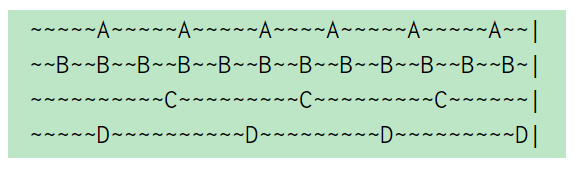

#### maxmemory、maxmemory-policy参数:
    如果redis配置了maxmemory和maxmemory-policy策略，则当redis内存数据达到maxmemory时，
    会根据maxmemory-policy配置来淘汰内存数据，以避免OOM。
#### 6种淘汰策略：

        1，noeviction：不执行任何淘汰策略，当达到内存限制的时候客户端执行命令会报错。
        2，allkeys-lru：从所有数据范围内查找到最近最少使用的数据进行淘汰，直到有足够的内存来存放新数据。
        3，volatile-lru：使用近似的LRU淘汰数据，仅设置过期的键。
        4，allkeys-random：从所有数据范围内随机选择key进行删除。
        5，volatile-random：从设置了过期时间的数据范围内随机选择key进行删除。
        6，volatile-ttl：删除最接近到期​​时间（较小的TTL）的键。,仅设置过期的键
        7, volatile-lfu	在设置了过期时间的键中，使用近似的LFU算法淘汰使用频率比较低的键。
        8，allkeys-lfu	使用近似的LFU算法淘汰整个数据库的键。
        
       
        
#### LFU算法(Least Frequently Used)
        
        如果一个数据在最近一段时间很少被访问到，那么可以认为在将来它被访问的可能性也很小。
        因此，当空间满时，最小频率访问的数据最先被淘汰。
        
#### LRU算法(The Least Recently Used)

      如果一个数据在最近一段时间没有被访问到，那么可以认为在将来它被访问的可能性也很小。
      因此，当空间满时，最久没有访问的数据最先被置换（淘汰）。

#### LFU与LRU的区别:

      提到缓存，有两点是必须要考虑的：
     （1）缓存数据和目标数据的一致性问题。
     （2）缓存的过期策略（机制）。
          其中，缓存的过期策略涉及淘汰算法。常用的淘汰算法有下面几种：
     （1）FIFO：First In First Out，先进先出
     （2）LRU：Least Recently Used，最近最少使用
     （3）LFU：Least Frequently Used，最不经常使用
         注意LRU和LFU的区别。
         LFU算法是根据在一段时间里数据项被使用的次数选择出最少使用的数据项，
         即根据使用次数的差异来决定。而LRU是根据使用时间的差异来决定的。
         

#### 数据淘汰方法触发时机:
       
        在server.c文件中进行触发。
        if (server.maxmemory && !server.lua_timedout) {
        int out_of_memory = freeMemoryIfNeededAndSafe() == C_ERR;
        /* freeMemoryIfNeeded may flush slave output buffers. This may result
         * into a slave, that may be the active client, to be freed. */
        if (server.current_client == NULL) return C_ERR;
    
        /* It was impossible to free enough memory, and the command the client
         * is trying to execute is denied during OOM conditions or the client
         * is in MULTI/EXEC context? Error. */
        if (out_of_memory &&
            (c->cmd->flags & CMD_DENYOOM ||
             (c->flags & CLIENT_MULTI &&
              c->cmd->proc != execCommand &&
              c->cmd->proc != discardCommand)))
        {
            flagTransaction(c);
            addReply(c, shared.oomerr);
            return C_OK;
        }
    
        /* Save out_of_memory result at script start, otherwise if we check OOM
         * untill first write within script, memory used by lua stack and
         * arguments might interfere. */
        if (c->cmd->proc == evalCommand || c->cmd->proc == evalShaCommand) {
            server.lua_oom = out_of_memory;
        }
      }

#### 缓存池结构：
    
        struct evictionPoolEntry {
            //对象空闲时间,距离上次使用的时间间隔
            unsigned long long idle;    /* Object idle time (inverse frequency for LFU) */
            sds key;                    /* Key name. */
            sds cached;                 /* Cached SDS object for key name. */
            //数据库的id
            int dbid;                   /* Key DB number. */
        };
        

#### LFU算法的具体实现:
    
     为什么会出现LFU算法呢，考虑到LRU算法缺点，LRU算法只会把最近没有访问的key替换掉，但是这样有个坏处，只考虑
     了最近未使用的key,但没有考虑key的访问频率。因此在做替换时，需要把key的访问频率一起考虑进来。
     由此出现了LFU算法:
     算法原理:
        在LFU算法中，可以为每个key维护一个计数器。每次key被访问的时候，计数器增大。计数器越大，可以约等于访问越频繁。
     上述简单算法存在两个问题：
        在LRU算法中可以维护一个双向链表，然后简单的把被访问的节点移至链表开头，但在LFU中是不可行的，
        节点要严格按照计数器进行排序，新增节点或者更新节点位置时，时间复杂度可能达到O(N)。
        只是简单的增加计数器的方法并不完美。访问模式是会频繁变化的，一段时间内频繁访问的key一段时间之后可能会很少被访问到，
        只增加计数器并不能体现这种趋势。
     解决办法:
        第一个问题很好解决，可以借鉴LRU实现的经验，维护一个待淘汰key的pool。
        第二个问题的解决办法是，记录key最后一个被访问的时间，然后随着时间推移，降低计数器数量。
        
        第二个问题的解决办法是通过redisobj结构体实现的
        redis基类对象如下:
        typedef struct redisObject {
            unsigned type:4;
            unsigned encoding:4;
            unsigned lru:LRU_BITS; /* LRU time (relative to global lru_clock) or
                                    * LFU data (least significant 8 bits frequency
                                    * and most significant 16 bits access time). */
            int refcount;
            void *ptr;
        } robj;
        在LRU算法中，24 bits的lru是用来记录LRU time的，在LFU中也可以使用这个字段，不过是分成16 bits与8 bits使用：

               16 bits      8 bits
          +----------------+--------+
          + Last decr time | LOG_C  |
          +----------------+--------+
        高16 bits用来记录最近一次计数器降低的时间ldt，单位是分钟，低8 bits记录计数器数值counter。
        
        那么是如何实现对LFU更新的呢？
        void updateLFU(robj *val) {
            unsigned long counter = LFUDecrAndReturn(val);//根据最近访问时间，对LFU的访问次数做更新。
            counter = LFULogIncr(counter);
            val->lru = (LFUGetTimeInMinutes()<<8) | counter;
        }
        //实现访问次数随时间的衰减
        unsigned long LFUDecrAndReturn(robj *o) {
            unsigned long ldt = o->lru >> 8;//获取上次访问时间
            unsigned long counter = o->lru & 255;//获取访问次数
            //server.lfu_decay_time是否开启衰减时间
            unsigned long num_periods = server.lfu_decay_time ? LFUTimeElapsed(ldt) / server.lfu_decay_time : 0;
            if (num_periods)
                counter = (num_periods > counter) ? 0 : counter - num_periods;//对访问次数做更新，实现衰减
            return counter;
        }
        unsigned long LFUTimeElapsed(unsigned long ldt) {
            unsigned long now = LFUGetTimeInMinutes();//获取当前时间
            if (now >= ldt) return now-ldt;//计算机时间差
            return 65535-ldt+now;
        }

#### LRU算法的具体实现:
    
    Redis作者使用了一个近似算法来实现LRU.
    
    最简单实现方法:
    记录下每个key 最近一次的访问时间（比如unix timestamp），unix timestamp最小的Key，就是最近未使用的，把这个Key移除。
    看下来一个HashMap就能搞定。是的，但是首先需要存储每个Key和它的timestamp。
    其次，还要比较timestamp得出最小值。代价很大，不现实。
    
    第二种方法：换个角度，不记录具体的访问时间点(unix timestamp)，而是记录idle time：idle time越小，意味着是最近被访问的。
    

    比如A、B、C、D四个Key，A每5s访问一次，B每2s访问一次，C和D每10s访问一次。
    （一个波浪号代表1s），从上图中可看出：A的空闲时间是2s，B的idle time是1s，C的idle time是5s，D刚刚访问了所以idle time是0s。
    
    为什么不使用双向哈希链表实现呢？
    这里，用一个双向链表(linkedlist)把所有的Key链表起来，如果一个Key被访问了，将就这个Key移到链表的表头，
    而要移除Key时，直接从表尾移除。
    但是在redis中，并没有采用这种方式实现，它嫌LinkedList占用的空间太大了。
    Redis并不是直接基于字符串、链表、字典等数据结构来实现KV数据库，
    而是在这些数据结构上创建了一个对象系统Redis Object。在redisObject结构体中定义了一个长度24bit的unsigned类型的字段，
    用来存储对象最后一次被命令程序访问的时间.
    
    最初的具体实现，随机选择3个key,把idle time最大的key删除.这种实现lru的方法简单粗暴，但十分有效。缺点是每次随机选择时
    没有利用历史信息，需要在当前轮移除key时，利用好上一轮N个key的idle time信息
    改进策略，采用缓冲池技术(pooling):
    当每一轮移除Key时，拿到了这个N个Key的idle time，如果它的idle time比 pool 里面的 Key的idle time还要大，
    就把它添加到pool里面去。这样一来，每次移除的Key并不仅仅是随机选择的N个Key里面最大的，
    而且还是pool里面idle time最大的，并且：pool 里面的Key是经过多轮比较筛选的，
    它的idle time 在概率上比随机获取的Key的idle time要大，可以这么理解：pool 里面的Key 保留了"历史经验信息"。 

## 补充:
#### C方法:
        
     C 库函数 void *memmove(void *str1, const void *str2, size_t n) 从 str2 复制 n 个字符到 str1，
     但是在重叠内存块这方面，memmove() 是比 memcpy() 更安全的方法。
     如果目标区域和源区域有重叠的话，memmove() 能够保证源串在被覆盖之前将重叠区域的字节拷贝到目标区域中，
     复制后源区域的内容会被更改。如果目标区域与源区域没有重叠，则和 memcpy() 函数功能相同。
     
     size_t 
     C/C++语言中预定义的数据类型
     typedef  unsigned long size_t;

## 参考:

    https://www.cnblogs.com/Jackeyzhe/p/12616624.html
    https://www.jianshu.com/p/0dd701d1442d
    https://www.cnblogs.com/hapjin/archive/2019/06/07/10933405.html
