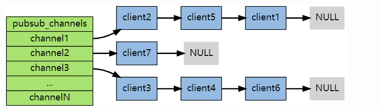

## 发布订阅原理:
    redis的server端结构体有这个属性字典pubsub_channels，是一个
    基于key-value的字典。
    每个channel对一个桶，用来存放订阅该频道的客户端

## 缺点:
    Redis无法对消息持久化存储，一旦消息被发送，如果没有订阅者接收，那么消息就会丢失。

## 小计:
    void addReply(client *c, robj *obj)：
    添加对象'obj'字符串表示到客户端输出缓冲区