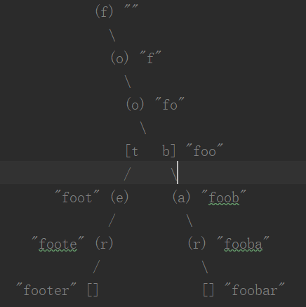
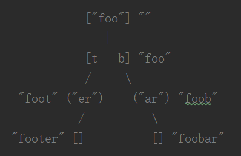

## rax(基数树)
    Rax 是 Redis 内部比较特殊的一个数据结构，它是一个有序字典树 (基数树 Radix Tree)，
    按照 key 的字典序排列，支持快速地定位、插入和删除操作;
    它是一种基于存储空间优化的前缀树数据结构;
    基数树和字典树相类似；但是字典树需要将26个字母全部表示出来；
    最普通表示方法:

    
    经过压缩后的表示方法:
    

## 基数树的优势
   
   1、快速检索单词，查找某个前缀单词开头的有哪些。
   2、可以存储具有相同公共前缀的名称，比如Redis中stream下的消息
   3、内存中使用rax树，可以大大节省内存空间，提升查询速度
    

## 小记:
    typedef struct raxNode {
    //是否有key,如果无key是根节点
    uint32_t iskey:1; //位域，冒号:实际需要使用的位数    
    //如果没有对应的value,则是无意义的节点
    uint32_t isnull:1;    
    //是否压缩存储
    uint32_t iscompr:1;   
    uint32_t size:29; 
    //上面四个字段加起来一共使用32位，四个字节
    
    //没有被压缩
    [header iscompr=0][abc][a-ptr][b-ptr][c-ptr](value-ptr?)
    //如果被压缩了
    [header iscompr=1][xyz][z-ptr](value-ptr?)
    
    
    //路由键，子节点、指针等均在这里
    unsigned char data[];//占用0个字节
    }