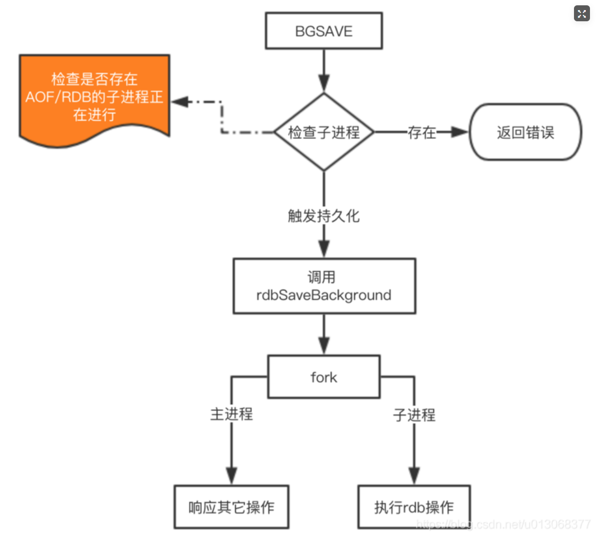
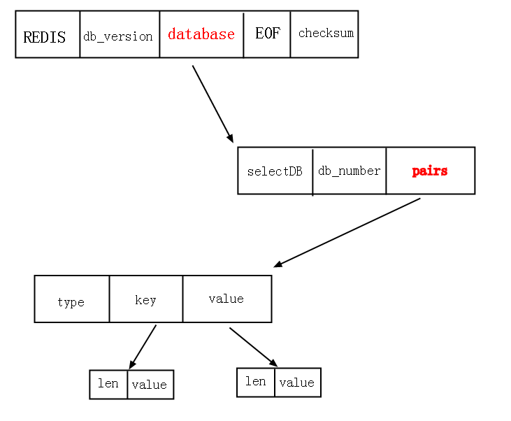

## rdb特点:
    RDB方式，是将redis某一时刻的数据持久化到磁盘中，是一种快照式的持久化方法。
    redis在进行数据持久化的过程中，会先将数据写入到一个临时文件中，待持久化过程都结束了，
    才会用这个临时文件替换上次持久化好的文件。正是这种特性，让我们可以随时来进行备份，
    因为快照文件总是完整可用的。

#### 持久化方式    
    1、同步、阻塞 save命令
    由主进程对RDB进行落盘，缺点是造成其它请求阻塞。
    2、异步、非租塞 bgsave命令
    redis会单独创建（fork）一个子进程来进行持久化，而主进程是不会进行任何IO操作的，
    这样就确保了redis极高的性能。在这里fork()方法也会造成主进程阻塞，只不过是短暂的。
    
    如果需要进行大规模数据的恢复，且对于数据恢复的完整性不是非常敏感，
    那RDB方式要比AOF方式更加的高效。
    
    虽然RDB有不少优点，但它的缺点也是不容忽视的。如果你对数据的完整性非常敏感，
    那么RDB方式就不太适合你，因为即使你每5分钟都持久化一次，

#### RDB缺点：    
    当redis故障时，仍然会有近5分钟的数据丢失。所以，redis还提供了另一种持久化方式，那就是AOF。
    AOF是将所有的写命令追加AOF文件中。
    RDB是基于数据的模式持久化，AOF是基于日志的模式进行持久化。

## RDB后台持久化为什么使用的子进程而不是线程？

    首先Redis在对RDB持久化时，先判断是否有子进程存在，如果没有，使用的是fork()方法创建一个子进程，然后子进程
    对内存中的RDB数据持久化到磁盘。fork()方法相当于是父进程的一个拷贝，此时内存占有率会变成2倍。
    并且fork()完成后，子进程和父进程互相独立，进程地址空间也无交集。
    如果RDB比较大，将会非常消耗资源。
    
    这里有一点需要注意，fork()函数调用完成后，OS只是对子进程地址空间进行了分配，但是并没有将主进程数据
    拷贝到子进程地址空间。内核采用的是写时拷贝技术(CopyOnWrite),也就是说只有父子进程再对某个物理页进行写入时，
    才会将该物理页拷贝到子进程地址空间，也就说只有在fork完成后，父子进程虚拟地址空间不同，物理地址空间一样。
    
    
#### 代码逻辑
    
    //后台fork一个子进程，保存数据到磁盘
    int rdbSaveBackground(char *filename, rdbSaveInfo *rsi) {
        pid_t childpid;
        //判断后台子进程是否存在，如果存在直接返回
        if (hasActiveChildProcess()) return C_ERR;
    
        openChildInfoPipe();
        
        //如果等于0，是子进程
        if ((childpid = redisFork()) == 0) {
            int retval;
            ...
            //执行rdbSave
            retval = rdbSave(filename,rsi);
            if (retval == C_OK) {
                sendChildCOWInfo(CHILD_INFO_TYPE_RDB, "RDB");
            }
            exitFromChild((retval == C_OK) ? 0 : 1);
        } else {
            //进入父进程
            if (childpid == -1) {//创建失败
                ...
                return C_ERR;
            }
            //返回ok
            return C_OK;
        }
        return C_OK; /* unreached */
    }
  
## rdb文件结构:
     
     
## LZF压缩编码:
     待续
     
## 参考
RDB与AOF https://g.yuque.com/wells/distributed/hd7m41?language=en-us