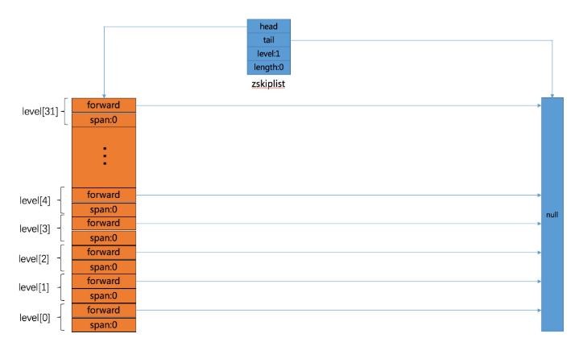

Redis跳跃表实现:
    
    /* ZSETs use a specialized version of Skiplists */
    typedef struct zskiplistNode {
        sds ele;//节点元素
        double score;//元素的优先级
        struct zskiplistNode *backward;//指向前驱节点
        //层号
        struct zskiplistLevel {
            struct zskiplistNode *forward;//前进指针
            unsigned long span;//跨度
        } level[];
    } zskiplistNode;

    typedef struct zskiplist {
        struct zskiplistNode *header, *tail;//头结点、尾结点
        unsigned long length;//长度
        int level;//级别
    } zskiplist;

    typedef struct zset {
        dict *dict;
        zskiplist *zsl;
    } zset;

初始化:

    zskiplist *zslCreate(void) {
        int j;
        zskiplist *zsl;
    
        zsl = zmalloc(sizeof(*zsl));
        zsl->level = 1;
        zsl->length = 0;
        zsl->header = zslCreateNode(ZSKIPLIST_MAXLEVEL,0,NULL);
        for (j = 0; j < ZSKIPLIST_MAXLEVEL; j++) {
            zsl->header->level[j].forward = NULL;
            zsl->header->level[j].span = 0;
        }
        zsl->header->backward = NULL;
        zsl->tail = NULL;
        return zsl;
    }    

插入操作：

     /* Insert a new node in the skiplist. Assumes the element does not already
     * exist (up to the caller to enforce that). The skiplist takes ownership
     * of the passed SDS string 'ele'. */
    zskiplistNode *zslInsert(zskiplist *zsl, double score, sds ele) {
        zskiplistNode *update[ZSKIPLIST_MAXLEVEL], *x;
        unsigned int rank[ZSKIPLIST_MAXLEVEL];
        int i, level;
    
        serverAssert(!isnan(score));
        x = zsl->header;
        for (i = zsl->level-1; i >= 0; i--) {
            /* store rank that is crossed to reach the insert position */
            rank[i] = i == (zsl->level-1) ? 0 : rank[i+1];
            while (x->level[i].forward &&
                    (x->level[i].forward->score < score ||
                        (x->level[i].forward->score == score &&
                        sdscmp(x->level[i].forward->ele,ele) < 0)))
            {
                rank[i] += x->level[i].span;
                x = x->level[i].forward;
            }
            update[i] = x;
        }
        /* we assume the element is not already inside, since we allow duplicated
         * scores, reinserting the same element should never happen since the
         * caller of zslInsert() should test in the hash table if the element is
         * already inside or not. */
        level = zslRandomLevel();
        if (level > zsl->level) {
            for (i = zsl->level; i < level; i++) {
                rank[i] = 0;
                update[i] = zsl->header;
                update[i]->level[i].span = zsl->length;
            }
            zsl->level = level;
        }
        x = zslCreateNode(level,score,ele);
        for (i = 0; i < level; i++) {
            x->level[i].forward = update[i]->level[i].forward;
            update[i]->level[i].forward = x;
    
            /* update span covered by update[i] as x is inserted here */
            x->level[i].span = update[i]->level[i].span - (rank[0] - rank[i]);
            update[i]->level[i].span = (rank[0] - rank[i]) + 1;
        }
    
        /* increment span for untouched levels */
        for (i = level; i < zsl->level; i++) {
            update[i]->level[i].span++;
        }
    
        x->backward = (update[0] == zsl->header) ? NULL : update[0];
        if (x->level[0].forward)
            x->level[0].forward->backward = x;
        else
            zsl->tail = x;
        zsl->length++;
        return x;
    }
    
    