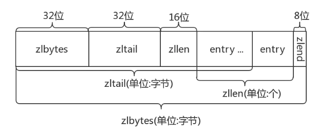
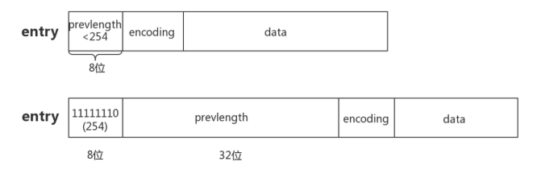

ziplist原理:

     ziplist是一个特殊编码的双链表，它是被设计节约内存空间而产生的,
     它支持字符串和整型数字，整型数字存储时是实际的整数，不是字符数组。
     ziplist可以在列表两端进行push与pop操作. 但是，因为每个操作都需要对ziplist重新分配
     内存使用，实际的复杂性是相关的ziplist使用的内存量。
     
ziplist整体结构:

     zlbytes: ziplist的长度（单位: 字节)，是一个32位无符号整数
     zltail: ziplist最后一个节点的偏移量，反向遍历ziplist或者pop尾部节点的时候有用。
     zllen: ziplist的节点（entry）个数
     entry: 节点
     zlend: 值为0xFF，用于标记ziplist的结尾

节点entry的布局:
    
     每个节点由三部分组成：prevlength、encoding、data
     
     prevlengh: 记录上一个节点的长度，为了方便反向遍历ziplist
     encoding: 当前节点的编码规则，下文会详细说
     data: 当前节点的值，可以是数字或字符串
     
     为了节省内存，根据上一个节点的长度prevlength 可以将ziplist节点分为两类：
     

     
     entry的前8位小于254，则这8位就表示上一个节点的长度
     entry的前8位等于254，则意味着上一个节点的长度无法用8位表示，后面32位才是真实的prevlength。
     用254 不用255(11111111)作为分界是因为255是zlend的值，它用于判断ziplist是否到达尾部。

     
     
    
