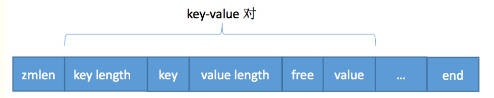

## zipmap原理:
    相比之前的dict字典，list列表等结构，zipmap在存储上进行了压缩。
    zipmap实际上使用一个具有连续内存的字符串来依次保存key和value.
    
    zipmap是用连续内存保存key-value对的结构，查询时是依次遍列每一个key-value对，直到查到为止。
    

#### 各个字段意义:
    
    1、zmlen大小1个字节，无符号整型，表示当前zipmap键值对数量，规定表示范围[0,253]
       如果entry数目大于253,即zmlen==254,那么需要遍历一遍才可以确定元素数目。
       
    2、key(value) length大小1个字节或者5个字节,
       a、假设随后的字符串（key或value）长度小于或等于253，直接用1个字节表示其长度。
       b、假设随后的字符串（key或value）长度超过或等于254。则用5个字节表示，当中第一个字节值为254，
       接下来的4个字节才是字符串长度。
       
    3、free大小1个字节，表示随后value后面的空闲字节数，举例子，假设zipmap存在”foo” => “bar”这样一个键值对，
        随后我们将“bar”设置为“hi”。此时free = 1，表示value字符串后面有1个字节大小的空暇空间。
        一般来说key指定后很少被改变，value是会随着使用而被改变。因此使用free标注剩余字节数目。
        如果对key的value进行修改，发现新的value空间不够怎么办？
  
    4、end大小1个字节，结尾符，值255
    
    从结构我们可以发现，zipmap就是一个key-value连续存放的内存区域，只不过其中加入了长度作为辅助索引

#### 关于压缩

    Redis是基于内存存储的，内存大小寸土寸金，因此把数据结构存储压缩到极致很有必要。
    比如zipmap存储map的结构如下：
    zlen keylen key valuelen free value ...  end
    zlen代表map中k-v个数，keylen代表key字符长度以及后面是key，valuelen代表value值大小，
    free又是什么呢？表示当时value空间还剩的字节个数，主要考虑到value经常动态修改，比如刚开始30个
    字符，set key name 后，可能改成10个了，那么free=20，标识内存剩余量。
    
    
    