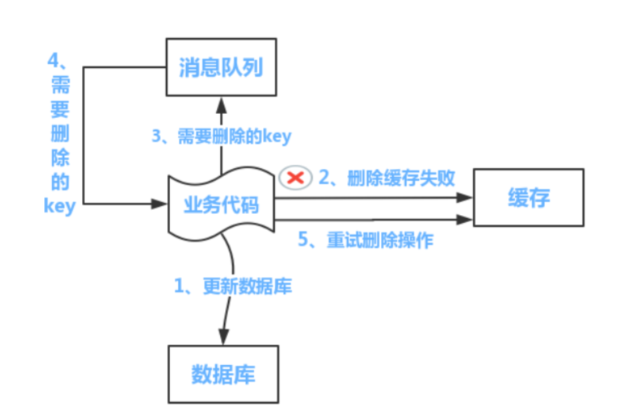

## Redis双写一致性问题
    只要使用缓存，就可能会涉及到缓存与数据库的双写，只要是双写，就一定会有数据一致性的问题。
    首先先介绍下经典的 Redis +  BD 的读写模式：
#### 一致性策略    
    读的时候，先读缓存，缓存没有的话，就读数据库，然后取出数据后放入缓存，同时返回响应。
    更新的时候，先删除缓存，在更新数据库。
    一致性策略：
    a.先更新缓存，再更新数据库
    b.先更新数据库，再更新缓存
    c.先删除缓存，再更新数据库
    d.先更新数据库，再删除缓存
#### 为什么是删除缓存，而不是更新缓存
    删除缓存比更新缓存更节省操作时间。
    1、因为很多时候，缓存中放的并不是简单的从数据中取出来值，
      可能要进行一个状态的替换，一些数据的计算，还有可能要进行数据的组合等等。
    2、二八法则，即20%的数据，占用了80%的访问量，这个更新的数据，可能是冷门数据，
      好久也访问不了不了一次，这样只会占用缓存内存。lazy思想，数据等你第一次要的时候再去加载，避免没必要的内存和时间浪费。

#### 先删除缓存，再更新数据库？
     假设场景，A和B两个线程，线程A写，线程B读：
     1、线程A发起一个写操作，第一步delete cache
     2、此时线程B发起一个读操作，cache miss
     3、线程B继续读数据库，读出来一个老数据
     4、然后老数据入cache
     5、线程A写入了最新的数据
     出现缓存与DB不一致问题。
      
###### 延迟双删策略

     例如在我们A请求进行写操作的时候，第一次删除缓存后，容易被B请求更新成脏数据，
     那就等一段时间(休眠一段时间)再进行删除缓存，可把之前B请求的脏数据删除掉，
     下次新请求进来查询的时候查不到缓存，会去数据库缓存最新值。
     疑问：B请求最终读取到的还是脏数据？
     
     如果是主从数据库呢？主库写，从库读。
     
     1、请求A进行写操作，删除缓存
     2、请求A将数据写入数据库了，
     3、请求B查询缓存发现，缓存没有值
     4、请求B去从库查询，这时，还没有完成主从同步，因此查询到的是旧值
     5、请求B将旧值写入缓存
     6、数据库完成主从同步，从库变为新值
     
     可适当延迟休眠时间，等待从库数据完成同步。
     如果第二次删除失败怎么办？
     

#### 先操作数据库，后删除缓存，较好保证一致性（[Cache-Aside pattern][1]）
    
    先写数据库，先入成功后，再让缓存失效。
    
    假设场景，A和B两个线程，线程A写，线程B读：
    1、线程A发起一个写操作，第一步写入数据到数据库
    2、线程A第二步delete cache
    3、线程B发起一个读操作，cache miss
    4、线程B从数据库获取最新数据
    5、线程B同时set cache
    可有效保证数据一致性。
    
    假设场景，A、B、C三个线程，线程A写，线程B写，C读：
    1、线程A发起一个写操作，第一步写入数据到数据库
    2、线程B发起一个写操作，第一步写入数据到数据库
    3、线程B第二步delete cache
    4、线程C发起一个读操作，cache miss
    5、线程C从数据库获取最新数据
    6、线程C同时set cache
    7、线程A第二步delete cache
    
    依然可有效保证一致性。
    
    极端情况：
    1、缓存刚好失效
    2、请求A查询数据库，得一个旧值
    3、请求B将新值写入数据库
    4、请求B删除缓存
    5、请求A将查到的旧值写入缓存
    上述情况出现的概率很低。

###### 异常情况
    假设删除缓存或者更新数据库失败了呢？以上讨论是二者正常情况。
    更新数据库失败，直接抛出异常。
    缓存更新失败：
    采取异步双删，
    将需要删除的缓存key发送到消息队列中，
    另起终端消费队列消息，获得需要删除的缓存key。
    设置重试删除操作，超过最大重试次数（比如5次）后将消息转入死信队列并报警给运维人员。

#### 终极解决办法

###### 方法1

###### 方法2

###### 一点思考
    
    1、上述两种通过binlog的方式去刷新缓存，如果缓存刷新失败，将消息打到消息队列，通过消费者做一次补偿刷新。
    但存在一个问题，从刷新失败到补偿成功的这段时间，如果有读请求到达，那么会从缓存中读到脏数据。主要考虑
    高并发的场景存在这个问题，该怎么解决呢？
    
    这种场景也是存在的，但是具体分业务场景，有的业务场景不会太关心脏数据，但有的要求读取到的必须是最新数据。    
    

    2、通过监听binlog日志的方式刷新缓存和通过请求读取从库刷新缓存，两者有啥不同呢，谁更快一些？

    3、缓存失效后，大量请求会打到DB，这时该怎么办呢，总有那么一刻，有大流量出现？
       
     如果是单机场景，参数Guava cache中的缓存失效机制实现方式，只有拿到锁的请求才会读取下游接口数据。
     同理，如果是分布式场景，可以通过分布式锁实现控制，比如Redis分布式锁，整个集群中一次只有一个请求可以拿到锁。
     其它同时到达的请求要么抛弃要么排队等待读取缓存数据。
     如果是分布式场景，集群数量非常大，甚至超过MySQL承受压力，考虑限流方案，比如对MySQL集群进行限流。
    

[1]:https://www.usenix.org/system/files/conference/nsdi13/nsdi13-final170_update.pdf